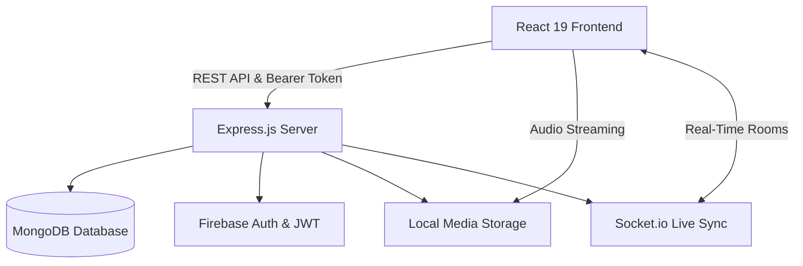
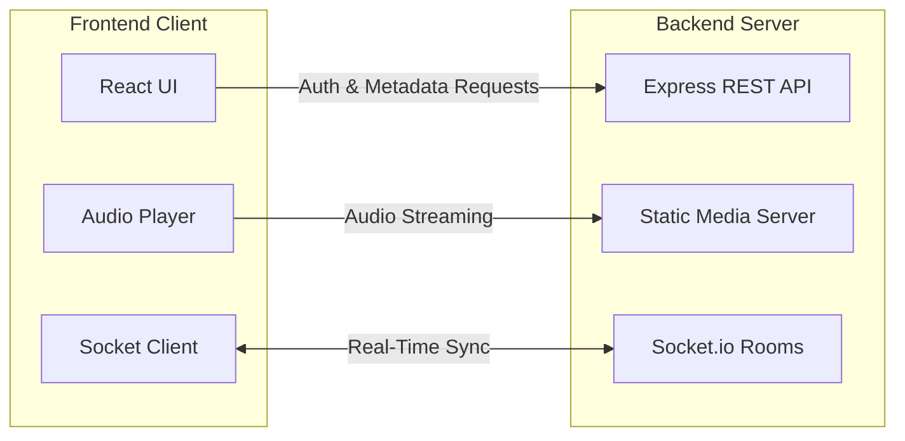
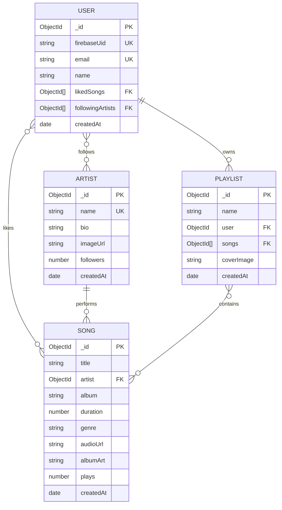

# TuneWave: Hi-Fi Music Streaming Platform

TuneWave is a full-stack, high-fidelity music streaming application and collaborative listening platform. The application combines a brutalist audio-first aesthetic with a robust micro-service inspired REST architecture, local static media streaming, Firebase and JWT hybrid authentication, and real-time room synchronization powered by WebSockets.

- **Live Frontend Application (Vercel)**: [https://tune-wave-backend-major-project.vercel.app](https://tune-wave-backend-major-project.vercel.app)
- **Live Backend API (Render)**: [https://tunewave-backend-major-project.onrender.com](https://tunewave-backend-major-project.onrender.com)
- **API Status Endpoint**: [https://tunewave-backend-major-project.onrender.com/](https://tunewave-backend-major-project.onrender.com/)

---

## Table of Contents

- [System Architecture](#system-architecture)
- [Technology Stack: What We Used and Why](#technology-stack-what-we-used-and-why)
  - [Backend Technologies](#backend-technologies)
  - [Frontend Technologies](#frontend-technologies)
- [Frontend to Backend Integration](#frontend-to-backend-integration)
  - [Authentication and Authorization Flow](#authentication-and-authorization-flow)
  - [Media Streaming and Range Requests](#media-streaming-and-range-requests)
  - [Real-Time WebSocket Synchronization](#real-time-websocket-synchronization)
  - [Scoped Playlist Playback Engine](#scoped-playlist-playback-engine)
- [Application Interface Tour](#application-interface-tour)
  - [Core Platform Walkthrough (s1 to s6)](#core-platform-walkthrough-s1-to-s6)
  - [Application Features and Views](#application-features-and-views)
- [Directory Structure](#directory-structure)
- [Database Schema Design](#database-schema-design)
- [API Endpoints Reference](#api-endpoints-reference)
- [Socket.io Event Specification](#socketio-event-specification)
- [Environment Configuration](#environment-configuration)
- [Installation and Setup](#installation-and-setup)
- [Testing with Postman](#testing-with-postman)

---

## System Architecture

The following flowchart illustrates the high-level architecture of TuneWave:



---

## Technology Stack: What We Used and Why

### Backend Technologies

- **Node.js**: Asynchronous event-driven JavaScript runtime. Chosen for non-blocking I/O capability, allowing the server to handle concurrent media stream requests, REST API transactions, and persistent WebSocket connections with minimal resource overhead.
- **Express.js (v5)**: Minimalist and extensible HTTP web framework for Node.js. Used for structuring RESTful routes, modular controller patterns, middleware chaining, and native handling of HTTP range headers for audio byte streaming.
- **MongoDB & Mongoose (v9)**: Document-oriented NoSQL database with object data modeling. Selected because music catalog entities (tracks, dynamic playlists, nested arrays of song IDs, user preference arrays) map cleanly to JSON-like documents without rigid join overhead. Mongoose provides schema validation, population of foreign references, and compound indexing.
- **Firebase Authentication & Firebase Admin SDK**: Cloud-based identity management. Used for enterprise-grade credential management, password hashing, and user validation without maintaining raw password hashes in the application database.
- **JSON Web Tokens (jsonwebtoken)**: Stateless authentication tokens. Once Firebase authenticates the user, our backend issues a signed JWT containing identity claims. The client transmits this token in the `Authorization: Bearer <token>` header, reducing round-trips to external identity providers for internal API operations.
- **Socket.io (v4)**: Low-latency WebSocket abstraction library with fallback mechanisms. Used to build shared listening rooms where multiple clients synchronize playback timestamp, song status, and participant counts in real time.
- **Multer**: Streaming multi-part form-data middleware. Employed for uploading local audio tracks (`.mp3`, `.wav`) and album/artist artwork directly to disk without requiring external paid cloud buckets.
- **CORS**: Cross-Origin Resource Sharing middleware. Configured to allow secure cross-origin communication between the Vite frontend (`http://localhost:5173`) and the Express backend (`http://localhost:8000`).
- **Dotenv**: Environment variable loader. Keeps configuration settings, secrets, and database URIs isolated from the codebase.

### Frontend Technologies

- **React (v19)**: Component-driven user interface library. Chosen for fast DOM reconciliation, declarative state hooks, and component composition across views such as the player, playlists, search, and artist roster.
- **Vite (v8)**: Modern frontend build tool and dev server. Utilized for rapid development start times, instant Hot Module Replacement (HMR), and production asset optimization.
- **Web Audio API**: Browser audio processing graph (`AudioContext`, `AnalyserNode`, `Uint8Array`). Used to extract real-time frequency data directly from audio playback and render an interactive spectrum visualizer on an HTML5 `<canvas>`.
- **Socket.io Client**: WebSocket client library that integrates with our real-time backend rooms, sending and receiving playback sync packets.
- **Lucide React**: Clean, modern icon library providing iconography for music controls, navigation tabs, volume indicators, and status badges.
- **Vanilla CSS (App.css & index.css)**: Curated custom CSS variables, glassmorphic blurs, brutalist typography, responsive bento grids, and fluid layout styling without heavy utility-framework bundle overhead.

---

## Frontend to Backend Integration

The following flowchart shows how the frontend communicates with the backend:



### Authentication and Authorization Flow
1. The frontend manages authentication state in React state and persists the token in browser `localStorage`.
2. When a user registers or logs in via `AuthPage.jsx`, an HTTP POST request is sent to `http://localhost:8000/api/auth/register` or `/api/auth/login`.
3. The backend validates the credentials using Firebase Identity Toolkit, ensures the user document exists in MongoDB, generates a signed JWT token, and returns user details.
4. For all subsequent protected requests (`/api/playlists`, `/api/artists/:id/follow`, `/api/auth/me`), the client includes the header:
   ```http
   Authorization: Bearer <token>
   ```
5. If the token is invalid or expired, the backend returns HTTP 401 Unauthorized, prompting the frontend to redirect to login.

### Media Streaming and Range Requests
1. Audio files and album artworks are stored on the server under `backend/uploads/audio/` and `backend/uploads/album-art/`.
2. The server exposes these assets using `express.static`:
   ```javascript
   app.use('/uploads', express.static(path.join(__dirname, 'uploads')));
   ```
3. When the client HTML5 `<audio>` element requests a track, standard HTTP `Range` headers (e.g. `bytes=0-`) are dispatched. Express responds with `HTTP 206 Partial Content` and `Accept-Ranges: bytes`.
4. This enables instant scrubbing, timeline jumping, and low-latency audio streaming without buffering the entire file into memory.

### Real-Time WebSocket Synchronization
1. The client establishes a persistent connection using `socket.io-client` targeting `http://localhost:8000`.
2. When entering a shared listening lounge, the client emits `joinRoom` with the target `roomId`.
3. The room controller maintains room state and broadcasts `nowPlaying` events containing `songId`, `title`, `currentTime`, and `isPlaying`.
4. Peer clients in the room receive updates and synchronize their local audio instances, enabling synchronized communal listening.

### Scoped Playlist Playback Engine
1. Each playlist is stored with a unique name scoped per user (`[user, name]` compound index).
2. When the user opens a playlist in `PlaylistDetailView.jsx` and clicks Play, the playback engine restricts its internal queue exclusively to the tracks in that playlist.
3. Next and Previous controls cycle within that scoped list, ensuring queue isolation between global discovery and custom playlists.
4. If a playlist contains fewer than four tracks, a fallback algorithm fills the 2x2 collage using the default album art or existing track artwork.

---

## Application Interface Tour

### Core Platform Walkthrough (s1 to s6)


---

### Application Features and Views

#### Authentication Portal


#### Live Catalog Search


#### Curated Artist Vault


#### Library and 4-Album Collages


#### Dedicated Playlist View


#### Fullscreen Canvas Visualizer


#### Real-Time Shared Rooms


#### Played History Log


---

## Directory Structure

```text
TuneWave/
├── App SS/                           # Application interface screenshots
│   ├── s1.png                        # Landing Hero Section
│   ├── s2.png                        # Landing Featured Bento Grid
│   ├── s3.png                        # Landing Mood Explorer
│   ├── s4.png                        # Landing Soundscape Detail
│   ├── s5.png                        # Landing Modern Footer
│   ├── s6.png                        # Discover Dashboard & Hi-Fi Player
│   ├── Sign up and login.png         # Authentication Portal
│   ├── search.png                    # Live Search Engine
│   ├── Artists.png                   # Curated Artist Vault
│   ├── playlist and liked .png       # Library Crates with 4-Album Collages
│   ├── Playlist Page.png             # Dedicated Playlist Detail View
│   ├── Song played.png               # Full-Screen Canvas Audio Visualizer
│   ├── Join Rooms.png                # Socket.io Shared Listening Rooms
│   └── Played History.png            # Listening History Log
├── backend/                          # Express.js REST API and WebSocket Server
│   ├── config/
│   │   ├── db.js                     # MongoDB Mongoose connection
│   │   ├── firebase.js               # Firebase Admin SDK initialization
│   │   └── serviceAccountKey.json   # Firebase service account (gitignored)
│   ├── controllers/
│   │   ├── artistController.js       # Artist discovery and follow operations
│   │   ├── authController.js         # Firebase Auth verification and JWT issuance
│   │   ├── playlistController.js     # Playlist CRUD and unique name validation
│   │   └── songController.js         # Song CRUD, search, and file uploads
│   ├── middleware/
│   │   ├── authMiddleware.js         # Bearer token verification
│   │   ├── uploadMiddleware.js       # Multer audio and image disk storage
│   │   └── validationMiddleware.js   # Request payload validation
│   ├── models/
│   │   ├── Artist.js                 # Artist Mongoose Schema
│   │   ├── Playlist.js               # Playlist Mongoose Schema
│   │   ├── Song.js                   # Song Mongoose Schema
│   │   └── User.js                   # User Mongoose Schema
│   ├── routes/
│   │   ├── artistRoutes.js           # /api/artists
│   │   ├── authRoutes.js             # /api/auth
│   │   ├── playlistRoutes.js         # /api/playlists
│   │   └── songRoutes.js             # /api/songs
│   ├── uploads/                      # Local media storage directory
│   │   ├── album-art/                # Album cover image files
│   │   ├── artist-images/            # Artist portrait image files
│   │   └── audio/                    # MP3/WAV/FLAC audio files
│   ├── server.js                     # HTTP & WebSocket server entrypoint
│   ├── package.json                  # Backend dependencies and scripts
│   ├── .env.example                  # Environment template
│   ├── TuneWave.postman_collection.json # Comprehensive Postman test suite
│   └── TuneWave.postman_environment.json# Postman environment variables
├── frontend/                         # React 19 + Vite Single Page Application
│   ├── src/
│   │   ├── components/
│   │   │   ├── AuthPage.jsx          # Dedicated Login and Register portal
│   │   │   ├── BrutalistHero.jsx     # Landing hero component
│   │   │   ├── BrutalistNav.jsx      # Navigation bar with route toggles
│   │   │   ├── BrutalistFooter.jsx   # Brutalist audio footer
│   │   │   ├── MainApp.jsx           # Core streaming application interface
│   │   │   ├── MaximizedPlayer.jsx   # Fullscreen visualizer player
│   │   │   ├── MoodMatrix.jsx        # Landing mood soundscape grid
│   │   │   ├── PlaylistCollage.jsx   # Dynamic 2x2 album art collage generator
│   │   │   ├── PlaylistDetailView.jsx# Dedicated playlist view with scoped queue
│   │   │   └── PosterGrid.jsx        # Bento grid track display
│   │   ├── App.jsx                   # Top-level routing and authentication state
│   │   ├── App.css                   # Custom brutalist stylesheet
│   │   ├── index.css                 # Base resets and typography tokens
│   │   └── main.jsx                  # React DOM mount point
│   ├── package.json                  # Frontend dependencies
│   └── vite.config.js                # Vite configuration
├── .gitignore                        # Git exclusion rules
└── README.md                         # Documentation
```

---

## Database Schema Design



### Schema Rules and Constraints
- **User**: Identified by a unique `firebaseUid` and `email`. Stores references to liked songs and followed artists.
- **Song**: References an `Artist` model via `artist` ObjectId. Stores file paths for streaming (`audioUrl`) and cover display (`albumArt`).
- **Artist**: Maintains follower counts and profile images. Incremented atomically upon follow operations.
- **Playlist**: Includes a unique compound index on `{ user: 1, name: 1 }` ensuring that a user cannot create two playlists with the exact same name while allowing different users to share common names (e.g., "Favorites").

---

## API Endpoints Reference

### Authentication Endpoints (`/api/auth`)

| Method | Endpoint | Access | Description |
|---|---|---|---|
| `POST` | `/api/auth/register` | Public | Registers a user with Firebase Auth, creates a MongoDB User, and returns a signed JWT. |
| `POST` | `/api/auth/login` | Public | Validates credentials via Firebase Identity Toolkit, confirms MongoDB record, and returns a JWT. |
| `GET` | `/api/auth/me` | Protected | Returns the authenticated user's profile, liked tracks, and followed artists. |

### Songs Endpoints (`/api/songs`)

| Method | Endpoint | Access | Description |
|---|---|---|---|
| `GET` | `/api/songs` | Public | Retrieves all songs with populated artist details. |
| `GET` | `/api/songs/:id` | Public | Retrieves a specific song by its MongoDB ObjectId. |
| `GET` | `/api/songs/search?keyword=:query` | Public | Searches songs by title, album, artist name, or genre. |
| `POST` | `/api/songs` | Protected | Creates a new song. Accepts `multipart/form-data` with `audio` and `albumArt` files or URLs. |
| `PUT` | `/api/songs/:id` | Protected | Updates song metadata or uploaded media. |
| `DELETE` | `/api/songs/:id` | Protected | Deletes a song from the database. |

### Playlists Endpoints (`/api/playlists`)

| Method | Endpoint | Access | Description |
|---|---|---|---|
| `POST` | `/api/playlists` | Protected | Creates a new playlist with validated song references and duplicate name protection. |
| `GET` | `/api/playlists/user/:id` | Protected | Retrieves all playlists belonging to the specified user ID. |
| `PUT` | `/api/playlists/:id` | Protected | Updates a playlist's name or tracklist. Validates ownership before saving. |

### Artists Endpoints (`/api/artists`)

| Method | Endpoint | Access | Description |
|---|---|---|---|
| `GET` | `/api/artists/:id` | Public | Retrieves artist profile, bio, image, and total follower count. |
| `POST` | `/api/artists/:id/follow` | Protected | Follows or unfollows an artist and updates follower counters. |
| `PUT` | `/api/artists/:id` | Protected | Updates artist details or uploads an artist image (`artistImage`). |

---

## Socket.io Event Specification

Connecting endpoint: `http://localhost:8000/socket.io/?EIO=4&transport=websocket`

### Client-to-Server Events

- `joinRoom(roomId)`: Joins a shared listening room.
  ```json
  "room-lofi-chill"
  ```
- `leaveRoom(roomId)`: Departs the active listening room.
  ```json
  "room-lofi-chill"
  ```
- `nowPlaying(payload)`: Broadcasts current playback state to all peers in the room.
  ```json
  {
    "roomId": "room-lofi-chill",
    "songId": "65f01ab29c4e2a10b8e7c112",
    "title": "Blinding Lights",
    "currentTime": 42.5,
    "isPlaying": true
  }
  ```

### Server-to-Client Events

- `userJoined`: Emitted when a peer connects, providing updated listener counts.
- `userLeft`: Emitted when a peer disconnects.
- `playbackSync`: Emitted to sync playback position and track data across room participants.

---

## Environment Configuration

### Backend Configuration (`backend/.env`)

Create a `.env` file inside the `backend/` folder based on `.env.example`:

```env
PORT=8000
MONGO_URI=mongodb://127.0.0.1:27017/TuneWave
JWT_SECRET=tunewave_jwt_super_secret_development_key_2026
FIREBASE_API_KEY=your_firebase_web_api_key_here
```

### Firebase Service Account (`backend/config/serviceAccountKey.json`)

To enable administrative user verification, place your Firebase service account key in:

```text
backend/config/serviceAccountKey.json
```

---

## Installation and Setup

### Prerequisites
- Node.js (v18 or higher)
- MongoDB instance running locally on `mongodb://127.0.0.1:27017` or via MongoDB Atlas connection string
- npm or yarn package manager

### 1. Clone Repository
```bash
git clone https://github.com/your-username/TuneWave.git
cd TuneWave
```

### 2. Backend Setup
```bash
cd backend
npm install
cp .env.example .env
# Edit .env with your credentials
npm run dev
```
The backend server will initialize on `http://localhost:8000`.

### 3. Frontend Setup
Open a separate terminal window:
```bash
cd frontend
npm install
npm run dev
```
The client interface will launch on `http://localhost:5173`.

---

## Testing with Postman

A pre-configured Postman test suite is provided in the `backend/` directory:
- `backend/TuneWave.postman_collection.json`
- `backend/TuneWave.postman_environment.json`

### Running with Newman (Command Line)
```bash
cd backend
npx -y newman run TuneWave.postman_collection.json -e TuneWave.postman_environment.json
```

### Running in Postman App
1. Open Postman.
2. Click **Import** and select both files.
3. Select the **TuneWave Local Environment** in the environment selector.
4. Execute the collection runner to verify all authentication, song, playlist, and artist endpoints.

---

## License

This project is licensed under the ISC License. All design assets, visualizers, and code are distributed for educational and development purposes.
