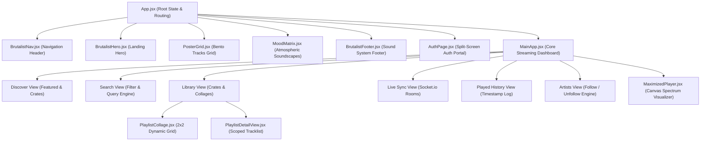
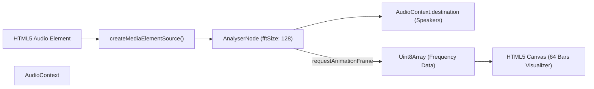
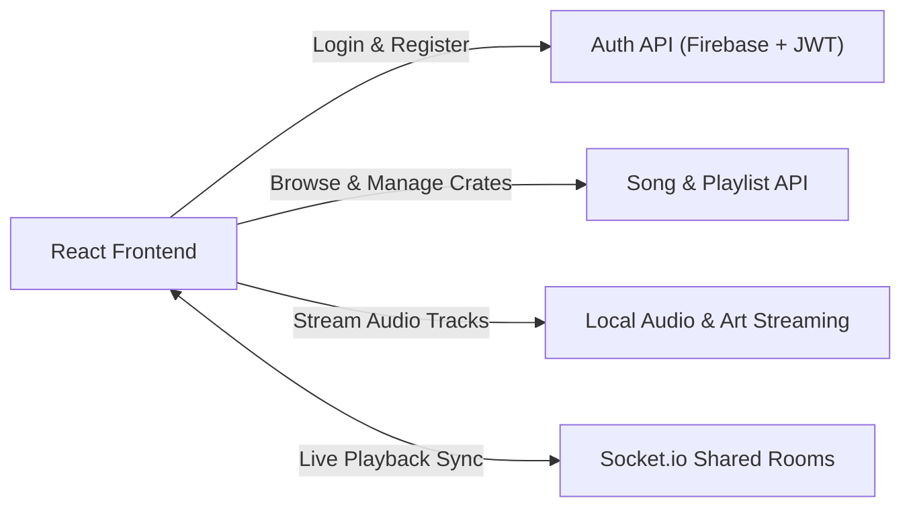

# TuneWave Frontend: Hi-Fi Streaming Client

The TuneWave frontend is a single-page web application built with React 19 and Vite. It delivers a brutalist, audio-first user interface featuring interactive canvas audio visualizers, dynamic 4-album playlist collages, real-time shared room synchronization, and low-latency audio streaming.

- **Deployed Backend API (Render)**: [https://tunewave-backend-major-project.onrender.com](https://tunewave-backend-major-project.onrender.com)

---

## Table of Contents

- [Overview and Architectural Philosophy](#overview-and-architectural-philosophy)
- [Technology Stack: What We Used and Why](#technology-stack-what-we-used-and-why)
- [Component Architecture](#component-architecture)
- [Web Audio API and Canvas Visualizer](#web-audio-api-and-canvas-visualizer)
- [Frontend to Backend Integration](#frontend-to-backend-integration)
  - [API Client and JWT Storage](#api-client-and-jwt-storage)
  - [Audio Streaming via HTTP Range Requests](#audio-streaming-via-http-range-requests)
  - [Real-Time WebSocket Synchronization](#real-time-websocket-synchronization)
- [Key Features and Subsystems](#key-features-and-subsystems)
  - [Scoped Playlist Playback Engine](#scoped-playlist-playback-engine)
  - [Dynamic 4-Album Collage Generator](#dynamic-4-album-collage-generator)
  - [Cross-Field Search and Genre Filter](#cross-field-search-and-genre-filter)
  - [Session Playback History](#session-playback-history)
- [Project Directory Structure](#project-directory-structure)
- [Installation and Development](#installation-and-development)

---

## Overview and Architectural Philosophy

The TuneWave client is designed around the concept of tactile audio hardware:
- **Brutalist Visual Language**: High-contrast typography, monochrome borders, glassmorphic overlays, and raw industrial music crate layouts.
- **Audio-Centric Lifecycle**: The audio element and playback state persist independently across view transitions, ensuring uninterrupted playback while browsing tracks, inspecting artist profiles, or managing playlists.
- **Real-Time Responsiveness**: WebSocket integration provides instant presence and state synchronization for collaborative rooms.

---

## Technology Stack: What We Used and Why

- **React 19**: Chosen for efficient declarative rendering, concurrent UI updates, and clean hook-based state management (`useState`, `useEffect`, `useRef`, `useCallback`). It enables atomic state updates for track playback without causing unnecessary re-renders of heavy canvas elements.
- **Vite 8**: Modern build tool delivering sub-second cold server starts and instant Hot Module Replacement (HMR). Ensures a rapid developer feedback loop and produces optimized production bundles.
- **Web Audio API (`AudioContext`, `AnalyserNode`)**: Native browser audio processing graph used to intercept audio signals, extract real-time frequency distribution arrays (`getByteFrequencyData`), and pipe data to HTML5 Canvas for real-time visualization.
- **Socket.io Client (v4)**: Low-latency client library providing automatic reconnection, heartbeat management, and room event listeners for communal listening sessions.
- **Lucide React**: Modern, scalable SVG iconography used for playback controls, library management, navigation headers, and volume sliders.
- **Custom Vanilla CSS (`App.css`, `index.css`)**: Built without third-party utility frameworks like Tailwind to provide total control over brutalist styling, custom CSS custom properties (tokens), responsive bento grid layouts, and canvas animations.

---

## Component Architecture



---

## Web Audio API and Canvas Visualizer

The audio visualizer is built using the browser-native Web Audio API without external visualization dependencies.



### Visualizer Pipeline Details
1. **Audio Node Interception**: In `MaximizedPlayer.jsx`, `audioContext.createMediaElementSource(audioRef.current)` wraps the native `<audio>` element.
2. **Frequency Analysis**: An `AnalyserNode` configured with `fftSize = 128` decomposes the incoming stream into 64 distinct frequency bins.
3. **Canvas Animation Frame**: A continuous `requestAnimationFrame` loop reads frequency amplitudes into a `Uint8Array` via `analyser.getByteFrequencyData()`.
4. **Drawing Output**: The canvas clears and renders 64 vertical bars with dynamic height interpolation, rounded heads, and responsive canvas scaling for Retina displays.

---

## Frontend to Backend Integration

The following flowchart illustrates how the frontend connects to the backend services:



### API Client and JWT Storage
- The frontend stores the issued JWT in `localStorage` under the key `'token'`.
- Protected HTTP calls attach the Authorization header:
  ```javascript
  headers: {
    'Content-Type': 'application/json',
    'Authorization': `Bearer ${localStorage.getItem('token')}`
  }
  ```
- When a `401 Unauthorized` status is received, the client clears the local token and transitions the interface to the `AuthPage.jsx` login state.

### Audio Streaming via HTTP Range Requests
- Native `<audio>` elements are loaded with the streaming URL from the backend:
  ```javascript
  audioRef.current.src = `http://localhost:8000${currentSong.audioUrl}`;
  ```
- The Express server responds with `Accept-Ranges: bytes` and `HTTP 206 Partial Content`.
- The user can scrub directly to any point in the track without waiting for the full file to download.

### Real-Time WebSocket Synchronization
- A single Socket.io connection is managed through `socket.io-client` targeting `http://localhost:8000`.
- Handlers in `MainApp.jsx` listen for room events:
  - `joinRoom`: Notifies the room that a new listener has joined.
  - `nowPlaying`: Sends current track playback timestamp and play/pause state.
  - `playbackSync`: Synchronizes the local audio player to the room host's timestamp.

---

## Key Features and Subsystems

### Scoped Playlist Playback Engine
When playing music directly from a playlist inside `PlaylistDetailView.jsx`:
1. The global queue is swapped for the playlist's specific track array.
2. The current song index is scoped to the playlist length.
3. Next and Previous buttons cycle strictly within that playlist rather than pulling global discovery tracks.

### Dynamic 4-Album Collage Generator
Implemented in `PlaylistCollage.jsx`:
- Takes an array of tracks belonging to a playlist.
- Extracts up to four distinct album artworks.
- If fewer than four tracks exist, fallback artwork fills the 2x2 grid to maintain a balanced cover aesthetic.

### Cross-Field Search and Genre Filter
Implemented in `MainApp.jsx`:
- Matches user input across song title, artist name, album name, and genre.
- Active genre pills allow one-click filtering for Hip-Hop, Pop, Electronic, Rock, and R&B.

### Session Playback History
- Tracks every completed or initiated playback event.
- Records track metadata, formatted relative timestamps, and increments play counts.
- Displays history chronologically in the Played History view with one-click replay capability.

---

## Project Directory Structure

```text
frontend/
├── public/                    # Static public assets
├── src/
│   ├── assets/                # Local graphic assets and logos
│   ├── components/            # UI components
│   │   ├── AuthModal.jsx      # Modal variant for quick authentication
│   │   ├── AuthPage.jsx       # Split-screen login & register portal
│   │   ├── BrutalistFooter.jsx# Minimalist sound system footer
│   │   ├── BrutalistHero.jsx  # Landing viewport with vinyl sleeve
│   │   ├── BrutalistNav.jsx   # Top navigation bar
│   │   ├── MainApp.jsx        # Complete streaming dashboard
│   │   ├── MaximizedPlayer.jsx# Fullscreen canvas visualizer
│   │   ├── MoodMatrix.jsx     # Atmospheric soundscape explorer
│   │   ├── PlaylistCollage.jsx# 2x2 album art collage generator
│   │   ├── PlaylistDetailView.jsx # Dedicated playlist detail view
│   │   └── PosterGrid.jsx     # Bento grid track cards
│   ├── context/               # React context definitions
│   ├── data/                  # Static soundscape and mood data
│   ├── App.css                # Global brutalist CSS variables and layout
│   ├── App.jsx                # Root component and top-level view router
│   ├── index.css              # Typography tokens and CSS resets
│   └── main.jsx               # Application entrypoint
├── package.json               # Dependencies and build scripts
├── vite.config.js             # Vite configuration
└── README.md                  # Frontend documentation
```

---

## Installation and Development

### Prerequisites
- Node.js (v18 or higher)
- Backend running on `http://localhost:8000`

### 1. Install Dependencies
```bash
npm install
```

### 2. Run Development Server
```bash
npm run dev
```
The application will be available at `http://localhost:5173`.

### 3. Build for Production
```bash
npm run build
```

### 4. Run Linter
```bash
npm run lint
```
